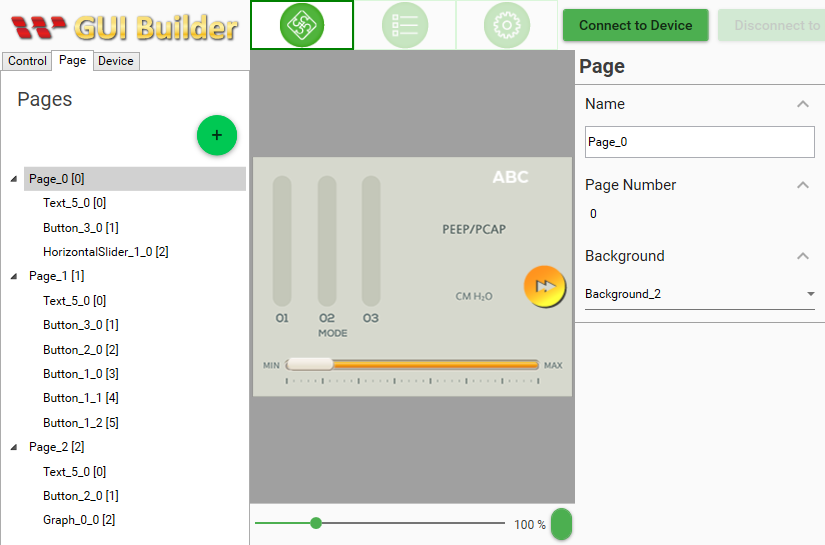

# Modbus-MultiPageOperation
This example shows switching pages,  buzzer, and brightness control with slider widget.

## Materials
* SmartDisplay with RS485/Modbus interface
* Arduino (Uno or Mega2560)
* RS485 shield for Arduino (https://www.dfrobot.com/product-1024.html)
* Variable resister (VR)
* RS485 dongle

## Libraries
* ModbusMaster (Install using Library Manager)

## UI Design
Reference GUI design for 3.5":

|Page|Widget ID |   Type  | Style |Pos X|Pos Y| Function          |
|:--:|:--------:|:-------:|:-----:|:---:|:---:|:------------------|
|  0 |     0    | Text    |   5   | 240 |  10 |                   |
|    |     1    | Button  |   3   | 270 | 108 | Goto Page 1       |
|    |     2    | HSlider |   1   |  35 | 188 | Adjust Brightness |
|  1 |     0    | Text    |   5   |  10 |  10 |                   |
|    |     1    | Button  |   3   | 270 | 108 | Goto Page 2       |
|    |     2    | Button  |   2   |   6 | 108 | Goto Page 0       |
|    |     3    | Button  |   1   | 133 |  96 | Buzzer            |
|  2 |     0    | Text    |   5   |  10 |  10 |                   |
|    |     1    | Button  |   2   |   6 | 108 | Goto Page 1       |
|    |     2    | Graph   |   0   |  72 |  80 | A0 input curve    |

Please note that only Widget ID and Type matters. You are free to change other attributes.

## Wiring
* VR Vcc to 5V, GND to GND, Output to Arduino A0
* RS485 Shield A to SmartDisplay RS485+
* RS485 Shield B to SmartDisplay RS485-
